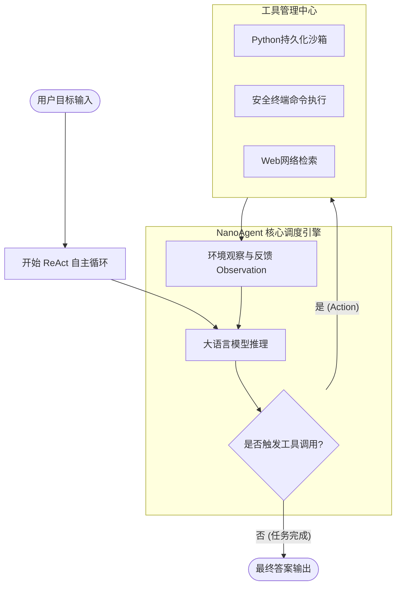

<div align="center">

# ⚡ NanoAgent

**从零手写极致轻量、透明、无过度封装的现代化 AI 智能体框架**  
*A Minimalist, Educational AI Agent Framework from Scratch in < 200 Lines of Pure Python.*

[](https://opensource.org/licenses/MIT)
[](https://www.python.org/downloads/)
[](https://github.com/guan110110/NanoAgent/actions)
[](#-支持的模型与服务)
[](https://github.com/guan110110/NanoAgent/pulls)

[English](#english-overview) | [简体中文](#-为什么设计-nanoagent)

</div>

---

## 💡 为什么设计 NanoAgent？

当前各大开源社区充斥着庞大而复杂的 Agent 框架（如 LangChain、AutoGPT、CrewAI）。随着多层类继承、复杂回调与层层抽象的叠加，许多学习者常常困惑：
* **大模型到底接收到了什么 Prompt？**
* **Function Calling 与 ReAct 循环是如何在底层一步步驱动环境与工具的？**
* **智能体执行失败时，究竟是如何根据报错信息完成“自主反思与自愈 (Self-Correction)”的？**

**NanoAgent 的宗旨是：做 Agent 领域的 nanoGPT。**  
彻底剥离一切沉重的包装与魔法语法糖，仅用不到 200 行标准纯 Python 代码，让读者在 10 分钟内看清现代自主智能体的每一个核心运转齿轮。

---

## 📂 项目规范目录结构

```text
NanoAgent/
├── .github/
│   └── workflows/ci.yml         # 自动化运行测试与代码规范检查 (GitHub Actions)
├── assets/                      # 架构图、演示动图素材
│   ├── banner.png               # 精美的科技风横幅
│   ├── demo.gif                 # 炫酷的终端彩色执行动图 (rich 渲染)
│   └── architecture.png         # 模块架构解析图
├── docs/                        # 详细的技术原理解析教程
│   ├── 01_understanding_fc.md   # 1. 深入剖析 Function Calling 底层原理
│   ├── 02_building_react.md     # 2. 从零构建经典 ReAct 范式
│   └── 03_reflection_mechanisms.md # 3. Agent 的自我反思与错误自愈机制
├── tutorials/                   # 核心教学单文件脚本（可一键直接运行）
│   ├── 01_raw_function_call.py  # Lesson 1: 最简原生函数调用
│   ├── 02_react_loop.py         # Lesson 2: 经典 ReAct 循环与状态反馈
│   ├── 03_sliding_memory.py     # Lesson 3: 滑动窗口长任务记忆管理
│   ├── 04_code_sandbox_self_heal.py # Lesson 4: Python REPL 代码沙箱与自愈实战
│   └── 05_mcp_client.py         # Lesson 5: 拥抱现代化协议 MCP (Model Context Protocol)
├── nano_agent/                  # 封装好的轻量 SDK 核心模块
│   ├── __init__.py
│   ├── core.py                  # Agent 核心循环与调度引擎
│   ├── tools/                   # 内置工具集
│   │   ├── bash.py              # 安全执行终端命令
│   │   ├── python_repl.py       # Python 代码持久化沙箱
│   │   └── web_search.py        # 免费网络信息检索
│   └── ui.py                    # 基于 Rich 的彩色终端高亮输出组件
├── examples/                    # 经典应用案例
│   ├── solve_math_with_code.py  # 示例 1: Agent 自动写 Python 算高难数学题
│   ├── autonomous_researcher.py # 示例 2: Agent 自主检索信息并整理研报
│   └── self_healing_demo.py     # 示例 3: 异常捕获与自我修复实战
├── tests/                       # 单元测试
│   └── test_agent.py
├── requirements.txt             # 核心依赖 (openai, rich, pydantic, pytest)
├── pyproject.toml               # PEP 517 标准打包配置
└── README.md
```

---

## ✨ 核心特性

- 🎯 **纯粹极简**：零沉重第三方框架依赖，只有标准的 `openai` 接口协议。
- 🔄 **完整 ReAct 循环**：严格遵循 `Thought -> Action -> Observation -> ... -> Final Answer` 范式。
- 🛡️ **天然错误自愈 (Self-Healing)**：工具报错不崩溃，错误信息作为观察结果自动反馈给大模型，驱动智能体自主修正参数与代码。
- 🎨 **终端高亮输出**：内置 Rich 彩色控制台，思考过程、工具调用与执行反馈层次分明，观感极佳。
- 🌐 **全模型通用**：原生兼容 DeepSeek、OpenAI、阿里云百炼、通义千问、Kimi、Ollama 本地大模型。

---

## 📊 对比主流框架

| 比较维度 | 传统厚重框架 (如 LangChain) | **NanoAgent (本项目)** |
| :--- | :--- | :--- |
| **代码量** | 动辄数万行，调用栈深不可测 | **< 200 行核心实现，透明清晰，可单步调试** |
| **调试难度** | 需要学习复杂的专用 Debugger 和 Callback | **直接 `print` 或单步断点调试，零心智负担** |
| **上手耗时** | 学习周期几天至数周 | **10 分钟看懂全部底层机制** |
| **自愈机制** | 内部黑盒处理或直接抛错 | **开放式异常捕获，直接作为 Observation 触发自愈** |

---

## 🏗️ 架构流转原理



---

## 🚀 30 秒极速上手

### 1. 克隆仓库与安装依赖

```bash
git clone https://github.com/guan110110/NanoAgent.git
cd NanoAgent

# 安装依赖（或通过 pip install -e . 安装为本地包）
pip install -r requirements.txt
```

### 2. 配置环境变量

复制 `.env.example` 为 `.env` 并填写你的 API Key（以极高性价比的 **DeepSeek** 为例）：

```bash
# Windows PowerShell
$env:DEEPSEEK_API_KEY="your-deepseek-api-key"
$env:BASE_URL="https://api.deepseek.com"
$env:MODEL_NAME="deepseek-chat"

# Linux / macOS
export DEEPSEEK_API_KEY="your-deepseek-api-key"
export BASE_URL="https://api.deepseek.com"
export MODEL_NAME="deepseek-chat"
```

### 3. 运行体验

直接体验模块化 SDK：
```bash
python examples/solve_math_with_code.py
```

或者跟着教程逐步运行单文件：
```bash
python tutorials/01_raw_function_call.py
python tutorials/02_react_loop.py
python tutorials/04_code_sandbox_self_heal.py
```

---

## 🛠️ 如何添加自定义工具？

利用自带的 `@agent.registry.register` 装饰器，您可以像写普通 Python 函数一样轻松挂载任何工具：

```python
from nano_agent import NanoAgent

agent = NanoAgent()

# 注册一个自定义天气查询工具
@agent.registry.register(
    name="get_weather",
    description="查询指定城市的天气温度",
    parameters={
        "type": "object",
        "properties": {
            "city": {"type": "string", "description": "城市名称，例如北京、上海"}
        },
        "required": ["city"]
    }
)
def get_weather(city: str) -> str:
    return f"{city} 当前天气晴朗，气温 22℃。"

# 开始执行
agent.run("帮我查一下北京今天的天气，并根据天气推荐穿衣风格。")
```

---

<div id="english-overview"></div>

## 🌐 English Overview

**NanoAgent** is an educational, production-ready AI Agent framework built from scratch in less than 200 lines of Python. It strips away all obscure layers of abstraction found in mainstream frameworks, making the mechanics of **ReAct loops, function calling, tool dispatching, and self-reflection** completely transparent and enjoyable to learn.

---

## 📄 开源许可证

本项目采用 [MIT License](LICENSE) 开源协议，欢迎自由学习、商用与二次开发。

如果你觉得这个项目对你理解 AI Agent 的运作原理有所帮助，请在 GitHub 上点一颗 **⭐️ Star** 支持一下！
